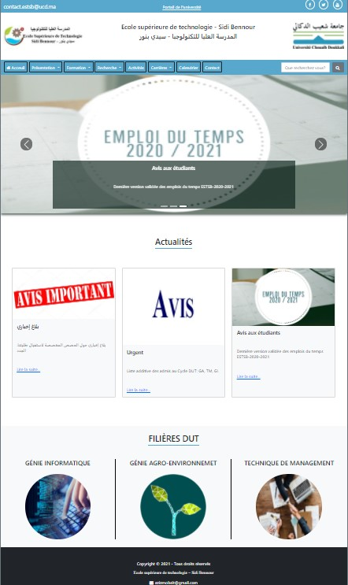

# Modele du site web de l'ESTSB avec wordpress

## Screenshot

## Comment installer ?
Pous télécharger le thème cliquez sur le bouton Code, puis sur le bouton de Download Zip.
Une fois que vous avez téléchargé le fichier Wordpress-modele-ESTSB-main.zip, vous pouvez accéder à votre "tableau de bord WordPress" >> Apparence >> Thèmes >> Ajouter >> Téléverser un thème >> Vous devez cliquer sur le bouton «Choisir un fichier», puis sélectionner le fichier ZIP sur votre ordinateur.
Ensuite, vous devez cliquer sur le bouton Installer maintenant. WordPress va maintenant télécharger l'archive zip de votre ordinateur sur votre site Web, la décompresser et installer le plugin pour vous.
Une fois cela fait, vous verrez un message de réussite. Vous pouvez ensuite cliquer sur le lien Activer le plugin pour activer le plugin sur votre site.

## Fonctionnalités du thème
+ Responsive
